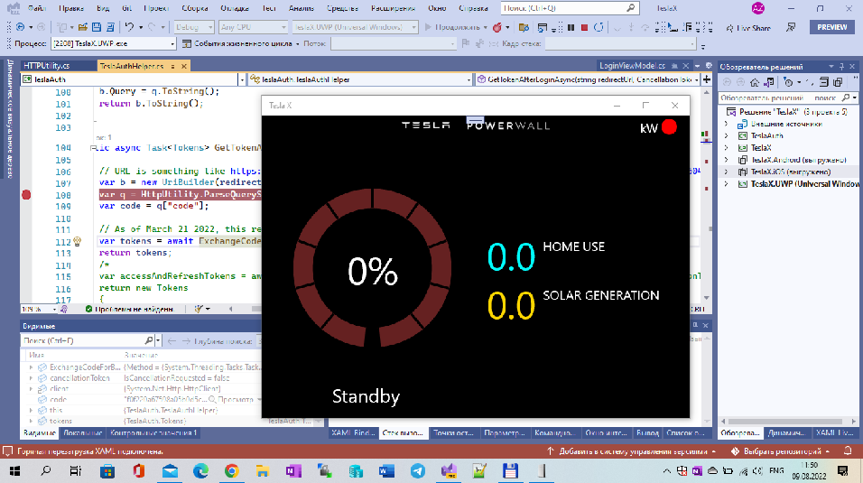

# TeslaX 

TeslaX is my fork of [PowerwallCompanionX](https://github.com/tomhollander/PowerwallCompanionX) project.

## Screenshots

## Tech details
Min. Windows OS build: 16299 (14393 in near future)) 

## Two words about original Powerwall Companion X

Powerwall Companion X is a XamarinForms-based Android app for monitoring your Tesla Powerwall 2 battery. 

It has similar functionality to the official Tesla app, but it's designed to be 
more of an "always on" dashboard, running on a spare device. 

Very cool app, IMHO :)

## My 2 cents

- Windows UWP version added;
- iOS version added (but not tuned by me because of "no iphone"))
- Few code comments added and app architecture revised for my future plans to port TeslaX at my "winphone" Lumia 950 :)

## DIY

I'm sharing the source in case anyone wants to improve it or is curious about the underlying APIs.

## Referencies

- [https://github.com/tomhollander](https://github.com/tomhollander) Tom Hollander, great C# .NET Developer
- [https://github.com/tomhollander/PowerwallCompanionX](https://github.com/tomhollander/PowerwallCompanionX) PowerwallCompanionX, original, for "Droidphones"
- [https://github.com/tomhollander/TeslaAuth](https://github.com/tomhollander/TeslaAuth) TeslaAuth .NET Standard 2 library for Tesla API auth

## .
AS IS. No support. RnD only.

## ..
-- [m][e] 2022